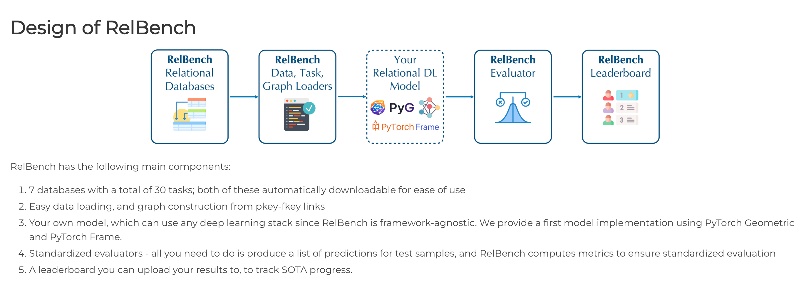

# RelBench for RDL

In this section, I train a Graph Neural Network (GNN) based model for a tabular prediction task using relbench and evaluate it with key metrics.

## References

1. [Relbench Documentation](https://relbench.stanford.edu/start/)

2. [Example Colab Notebook - Model Building](https://colab.research.google.com/github/snap-stanford/relbench/blob/main/tutorials/train_model.ipynb)