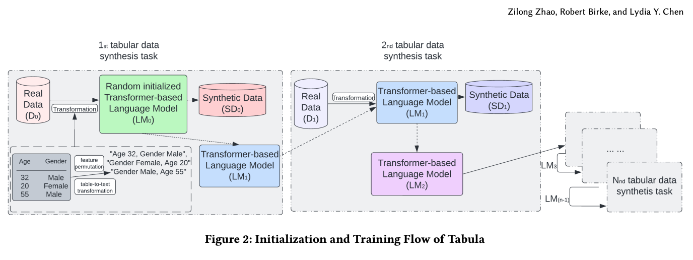

# Tabula9 Library for RDL

In this section, I use the Tabula-9 model to generate mock data based on real data using a language model and natural language text as input. I also run zero-shot inference using the Tabula model without prior pre-training or fine-tuning.

## References

1. [Example Notebook - Mock Data Generation](https://github.com/zhao-zilong/Tabula/blob/main/Tabula_on_insurance_dataset.ipynb)

2. [Example Notebook - Zero-shot Model Inference](https://github.com/mlfoundations/rtfm/blob/main/notebooks/inference.ipynb)