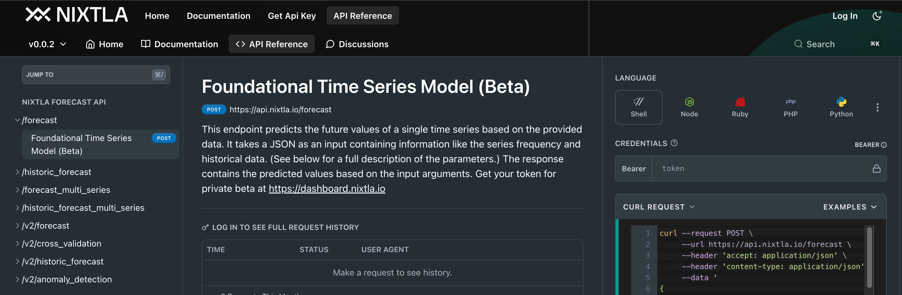

# TimeGPT for Timeseries (TS) Forecasting

In this section I use the attention model TimeGPT's API to predict or forecast using example multi-variate timeseries data using their 'long horizon' capabilities on energy and bitcoin related datasets (provided by TimeGPT's provider Nixtla). I also experiment with fine-tuning and anomaly detection using TimeGPT on an extraneous dataset.

## References

1. [Example Notebook - Multivariate TS Forecasting](https://docs.nixtla.io/docs/tutorials-multiple_series_forecasting)

2. [Example Notebook - TS Anomaly Detection](https://docs.nixtla.io/docs/tutorials-anomaly_detection)

3. [Example Notebook - Energy Forecasting](https://docs.nixtla.io/docs/use-cases-forecasting_energy_demand)

4. [Example Notebook - Bitcoin Forecasting](https://docs.nixtla.io/docs/use-cases-bitcoin_price_prediction)

5. [Example Notebook - Fine-tuning on Novel Data](https://docs.nixtla.io/docs/tutorials-fine_tuning)